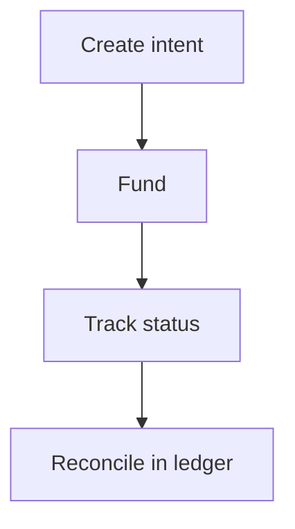

Remitflex gives you **programmable money movement** over HTTPS. You create payment intents — collection routes, pay links, or local fiat orders — fund them, and read status from one ledger.

Your integration never talks to blockchains, exchanges, or bank networks directly. You talk to Remitflex.

## Mental model

Every product follows the same five steps:

1. **Authenticate** with an API key (`rmf_test_` / `rmf_live_`)
2. **Create** a payment intent, optionally tied to a [customer](/products/customers)
3. **Fund** — send crypto to a deposit address, or instruct your user to transfer to a bank account
4. **Track** status until the order settles
5. **Reconcile** via `GET /v1/transactions` — filter by `customerId` when needed

## Core objects

| Object | Purpose |
|--------|---------|
| **Organisation** | Your tenant. Created at signup. Gets a primary customer automatically. |
| **Customer** | A payer, beneficiary, or counterparty under your org. Orders are tied to customers for reporting. |
| **Payment link** | Cross-chain pay URL (fixed or open amount) with hosted pay page and embed. API: `/v1/collections`. |
| **Payment route** | Cross-chain collection route with a persistent deposit address. |
| **Swap** | Solana EURC ↔ USDC conversion via deposit address. |
| **Offramp** | Stablecoin in → local fiat bank payout. |
| **Onramp** | Local fiat deposit → stablecoin delivery to a wallet. |
| **cNGN** | Customer Smart Wallet rails — NGN VA, convert, withdraw, bank payout. |
| **Transaction** | Ledger row for any product above — use for dashboards and reconciliation. |
| **API key** | Scoped programmatic access. Created in the dashboard. |

## Authentication layers

| Audience | Auth | Used for |
|----------|------|----------|
| Dashboard users | JWT (email + OTP) | Signup, login, API key management |
| Your backend | API key (Bearer) | All business endpoints |

Dashboard: [dashboard.remitflex.io](https://dashboard.remitflex.io)

API base: `https://api.remitflex.io/v1`

## Products

| Product | You send | Recipient gets | Best for |
|---------|----------|----------------|----------|
| **Payment links** | — (payer funds) | Stablecoin at your wallet | Invoices, checkout, embeddable pay buttons |
| **Payment routes** | — (payer funds) | Stablecoin on your chosen chain | Persistent collection addresses |
| **Swaps** | USDC or EURC on Solana | The other token on Solana | Treasury EURC↔USDC |
| **Offramps** | Stablecoin | Local fiat in a bank account | Supplier payouts, payroll, remittance to bank |
| **Onramps** | — (user deposits fiat) | Stablecoin at a wallet | Funding crypto wallets from local currency |
| **cNGN** | NGN or wallet tokens | Wallet / NGN bank | Customer VA + convert + payout |

## Scopes

API keys use fine-grained scopes. Grant only what each service needs:

| Scope | Access |
|-------|--------|
| `fx:read` | Fiat sell quotes and Solana swap rates |
| `transfers:read` | Customers, transactions, swaps, cNGN reads |
| `transfers:write` | Create customers, swaps, cNGN writes |
| `collections:read` | Read payment routes and payment links |
| `collections:write` | Create and manage payment routes and payment links |
| `offramps:read` | Read offramp orders, fiat currencies and institutions |
| `offramps:write` | Create/cancel offramps, verify bank accounts |
| `onramps:read` | Read onramp orders, fiat currencies and institutions |
| `onramps:write` | Create onramps, verify bank accounts |
| `payouts:read` / `payouts:write` | Deprecated aliases for `offramps:*` |
| `webhooks:read` / `webhooks:write` | Manage outbound webhook endpoints |

See [Authentication](/authentication) for key format and idempotency rules.

## What we do not do yet

- **Self-serve API key creation via API** — keys are created in the dashboard (JWT)
- **Custodial wallets** — scopes exist; wallet APIs are not live

For push updates, see [Webhooks](/guides/webhooks). The API surface will expand without breaking existing v1 contracts where possible.
