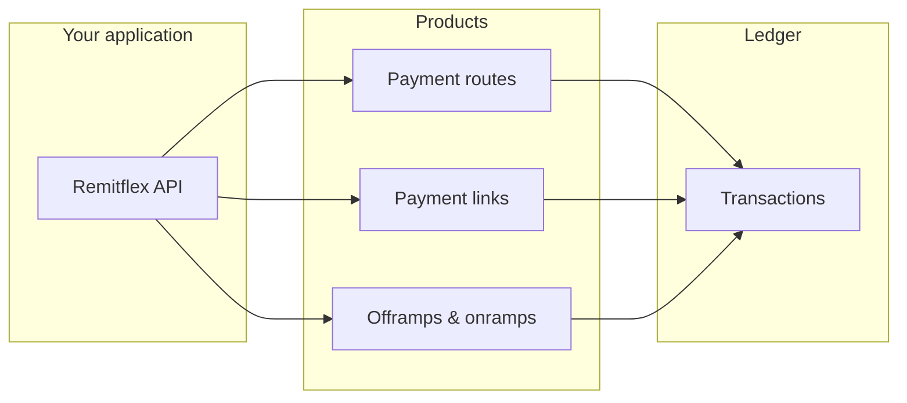

Remitflex is payment infrastructure for the African market. One REST API covers cross-chain collection, local bank payouts, and fiat-to-stablecoin deposits — with a single ledger for reconciliation.

You integrate with Remitflex. We handle wallets, FX, cross-chain routing, and local bank settlement behind the scenes.

<CardGroup cols={2}>
  <Card title="Quickstart" icon="rocket" href="/quickstart">
    API key, first payment route, first collection — under ten minutes.
  </Card>
  <Card title="Customers" icon="users" href="/products/customers">
    Organise payers and beneficiaries before you create payments.
  </Card>
  <Card title="Dashboard" icon="layout-dashboard" href="https://dashboard.remitflex.io">
    Sign up, manage API keys, and monitor activity at dashboard.remitflex.io.
  </Card>
  <Card title="Payment links" icon="link" href="/products/payment-links">
    Invoices (one payment) or checkout (reusable URL) — hosted pay pages with embed support.
  </Card>
  <Card title="Payment routes" icon="route" href="/products/payment-routes">
    Cross-chain collection for pay-ins across African and global corridors.
  </Card>
  <Card title="Local fiat" icon="building-columns" href="/products/fiat-rails">
    Pay local bank accounts from stablecoin, or collect fiat and deliver USDC.
  </Card>
  <Card title="API reference" icon="code" href="/api-reference/overview">
    Interactive playground for every endpoint.
  </Card>
</CardGroup>

## What Remitflex does

Every product follows the same integration pattern: create an intent, fund it, track status in the ledger.

| Product | What it solves | API |
|---------|----------------|-----|
| **Customers** | Organise payers and beneficiaries under your org | `GET/POST /v1/customers` |
| **Payment links** | Shareable pay URLs — invoice (one-off) or checkout (reusable) | `POST /v1/collections` |
| **Payment routes** | Collect on one chain, settle on another | `POST /v1/payment-routes` |
| **Offramps** | Send stablecoin, pay a local bank account | `POST /v1/offramps` |
| **Onramps** | Collect local fiat, deliver stablecoin to a wallet | `POST /v1/onramps` |
| **Transactions** | Single ledger for all products above | `GET /v1/transactions` |
| **Rates** | Live fiat sell rate quotes | `GET /v1/fiat/rates/...` |

## Built for African payments

Remitflex is designed for teams building:

- **Cross-border B2B** — pay suppliers and freelancers into local bank accounts from stablecoin treasury
- **Diaspora remittance** — collect stablecoins globally, settle to wallets or local fiat
- **Platform embeds** — marketplaces and payroll products that need programmable collection and payout

See [Networks & corridors](/concepts/networks-and-corridors) for typical flows, [African flows](/concepts/african-corridors) for business use cases, and [Platform overview](/concepts/platform) for how the pieces fit together.

## How it works

## Get started

<Steps>
  <Step title="Create an account">
    Register at [dashboard.remitflex.io](https://dashboard.remitflex.io) and complete email OTP verification.
  </Step>
  <Step title="Create an API key">
    In the dashboard, create a **test** key with scopes for the products you need. Add `collections:*` for payment routes and links, or `offramps:*` / `onramps:*` for local fiat.
  </Step>
  <Step title="Integrate">
    Follow the [Quickstart](/quickstart) or jump to [Payment links](/products/payment-links), [Payment routes](/products/payment-routes), or [Local fiat](/products/fiat-rails).
  </Step>
</Steps>

<Note>
  Prefer [outbound webhooks](/guides/webhooks) for status updates. You can still poll order endpoints or `GET /v1/transactions`.
</Note>
