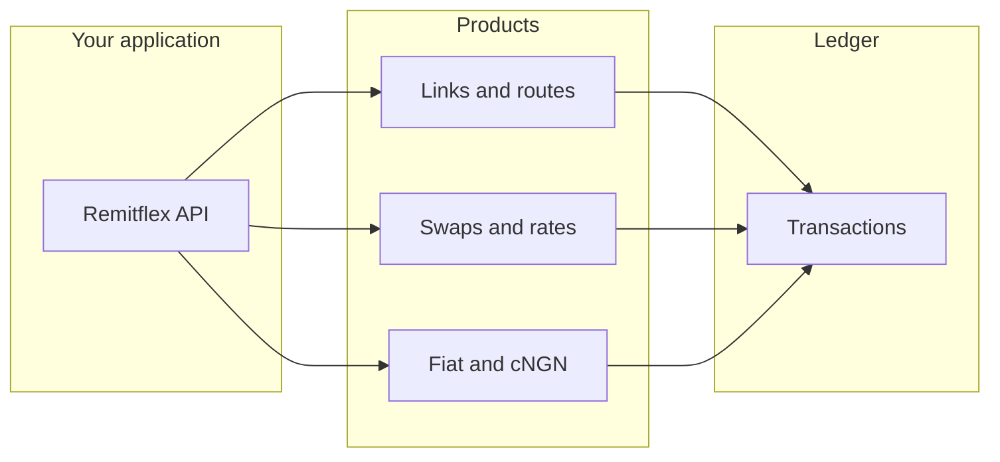

Remitflex is payment infrastructure for the African market. One REST API covers cross-chain collection, local bank payouts, and fiat-to-stablecoin deposits — with a single ledger for reconciliation.

You integrate with Remitflex. We handle wallets, FX, cross-chain routing, and local bank settlement behind the scenes.

## Choose a product

| You want… | Use | API |
|-----------|-----|-----|
| Shareable invoice / checkout URL | [Payment links](/products/payment-links) | `POST /v1/collections` |
| Persistent deposit address | [Payment routes](/products/payment-routes) | `POST /v1/payment-routes` |
| EURC ↔ USDC on Solana (treasury) | [Swaps](/products/swaps) | `POST /v1/swaps` |
| Stablecoin → local bank | [Local fiat](/products/fiat-rails) | `POST /v1/offramps` |
| Local bank → stablecoin wallet | [Local fiat](/products/fiat-rails) | `POST /v1/onramps` |
| NGN VA + cNGN wallet (convert / payout) | [cNGN](/products/cngn) | `/v1/cngn/*` |
| Live FX quotes | [Rates](/products/rates) | `/v1/fiat/rates/...` or `/v1/rates/...` |
| Reconcile everything | [Transactions](/products/transactions) | `GET /v1/transactions` |

See [Networks & corridors](/concepts/networks-and-corridors) and the [corridor matrix](/concepts/corridor-matrix) before collecting crypto.

<CardGroup cols={2}>
  <Card title="Quickstart" icon="rocket" href="/quickstart">
    API key, first payment route, first collection — under ten minutes.
  </Card>
  <Card title="Customers" icon="users" href="/products/customers">
    Organise payers and beneficiaries before you create payments.
  </Card>
  <Card title="Dashboard" icon="layout-dashboard" href="https://dashboard.remitflex.io">
    Sign up, manage API keys, and monitor activity at dashboard.remitflex.io.
  </Card>
  <Card title="API reference" icon="code" href="/api-reference/overview">
    Interactive playground for every endpoint.
  </Card>
</CardGroup>

## Typical African flows

1. **Collect globally** — payment link or route into USDC/USDT (or Solana EURC)
2. **Hold** in stablecoin treasury
3. **Pay locally** — offramp to a bank account, or cNGN payout from a customer wallet
4. **Reconcile** with `GET /v1/transactions`

## How it works

## Get started

<Steps>
  <Step title="Create an account">
    Register at [dashboard.remitflex.io](https://dashboard.remitflex.io) and complete email OTP verification.
  </Step>
  <Step title="Create an API key">
    In the dashboard, create a **test** key with scopes for the products you need (`collections:*`, `transfers:*`, `offramps:*` / `onramps:*`, `fx:read`).
  </Step>
  <Step title="Integrate">
    Follow the [Quickstart](/quickstart) or jump to a product from the table above.
  </Step>
</Steps>

<Note>
  Prefer [outbound webhooks](/guides/webhooks) for status updates. You can still poll order endpoints or `GET /v1/transactions`.
</Note>
