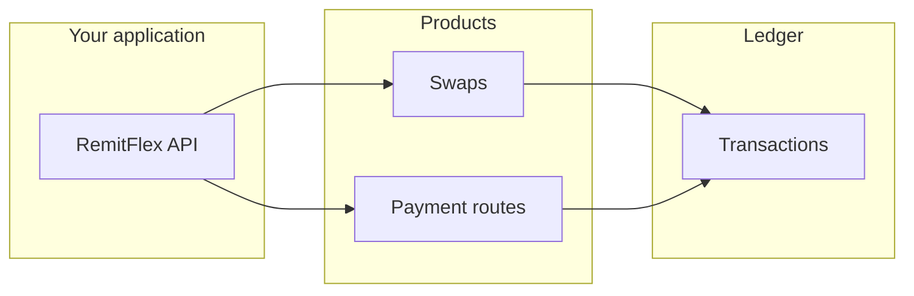

RemitFlex is stablecoin payment infrastructure for the African market — programmable money movement through a single REST API. Swaps, collection routes, customer records, and a unified ledger are all first-class resources.

We help businesses accept stablecoins, convert between denominations, and route value across chains without building wallet, FX, or cross-chain plumbing themselves.

<CardGroup cols={2}>
  <Card title="Quickstart" icon="rocket" href="/quickstart">
    API key, first rate check, first swap — under ten minutes.
  </Card>
  <Card title="Dashboard" icon="layout-dashboard" href="https://dashboard.remitflex.io">
    Sign up, manage API keys, and monitor activity at dashboard.remitflex.io.
  </Card>
  <Card title="Payment routes" icon="route" href="/products/payment-routes">
    Cross-chain collection for pay-ins across African and global corridors.
  </Card>
  <Card title="API reference" icon="code" href="/api-reference/overview">
    Interactive playground for every endpoint.
  </Card>
</CardGroup>

## What RemitFlex does

| Product | What it solves | API |
|---------|----------------|-----|
| **Swaps** | Convert USDC ↔ EURC and other Solana pairs | `POST /v1/swaps` |
| **Payment routes** | Collect on one chain, settle on another | `POST /v1/payment-routes` |
| **Customers** | Organise payers and beneficiaries under your org | `GET/POST /v1/customers` |
| **Transactions** | Single ledger for swaps + route deposits | `GET /v1/transactions` |
| **Rates** | Live cached FX for supported pairs | `GET /v1/rates` |

## Built for African payments

RemitFlex is designed for teams building:

- **Cross-border B2B** — suppliers, freelancers, and remittance corridors into and across Africa
- **Stablecoin treasuries** — hold USDC, pay out in local stablecoins or across chains
- **Platform embeds** — marketplaces and payroll products that need programmable collection addresses

See [African corridors](/concepts/african-corridors) for how we think about routing and [Platform overview](/concepts/platform) for the full mental model.

## How it works

## Get started

<Steps>
  <Step title="Create an account">
    Register at [dashboard.remitflex.io](https://dashboard.remitflex.io) and complete email OTP verification.
  </Step>
  <Step title="Create an API key">
    In the dashboard, create a **test** key with scopes for the products you need (`fx:read`, `transfers:write`, `collections:write`).
  </Step>
  <Step title="Integrate">
    Follow the [Quickstart](/quickstart) or jump to [Swaps](/products/swaps) / [Payment routes](/products/payment-routes).
  </Step>
</Steps>

<Note>
  Bank off-ramp and outbound webhooks are on the roadmap. Today, use swaps and payment routes plus the transactions ledger for status.
</Note>
