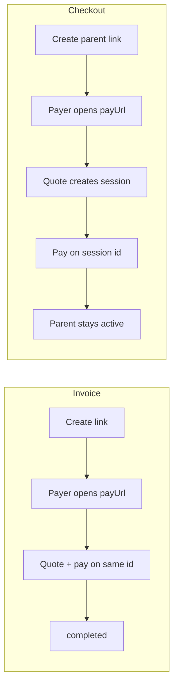

Share a **pay URL**. The payer chooses network and token on the hosted page. You receive stablecoins at your destination wallet.

**Scopes:** `collections:read`, `collections:write`  
**API path:** `/v1/collections` (ledger: `kind: "collection"`)  
**Dashboard:** [Payment Links](https://dashboard.remitflex.io/collections) — **Invoices** and **Checkout** tabs

## Invoice vs checkout

Every payment link has a **`linkMode`**. This controls how many times the URL can be used and how payments are tracked.

| | **Invoice** (`linkMode: "invoice"`) | **Checkout** (`linkMode: "checkout"`) |
|---|---|---|
| **Use case** | One bill, one payer, one payment | Storefront, donation page, reusable pay button |
| **URL** | Single-use — tied to one payment | Reusable — same URL for every visitor |
| **Resource** | One API object = one payment | One **parent** link + a **session** per payment |
| **Initial status** | `awaiting_origin` | Parent stays `active` |
| **After payer quotes** | Same object moves to `awaiting_deposit` | New **session** id; track payment on the session |
| **Embed** | Embed the invoice `id` | Embed the checkout parent `id` (sessions created automatically) |
| **List in API** | One row per invoice | One row per checkout link (`sessionCount` on parent) |



### Fixed vs open amount

Both modes support **`pricingType`**:

| `pricingType` | Behavior |
|---|---|
| **`fixed`** | You set `amount`. Payer must send the quoted amount before the quote expires (~1 min). |
| **`open`** | No preset amount. Payer sends any amount; you receive the equivalent on settlement. Same origin can re-quote and reuse the deposit address. |

**Typical pairings:**

- **Invoice + fixed** — “Pay invoice #1042 for $500”
- **Invoice + open** — “Send whatever you owe on this bill”
- **Checkout + fixed** — “Buy this product for $49” (new session each visit)
- **Checkout + open** — “Donate any amount” (new session each visit)

### When to use which

**Choose invoice** when you create a link for a specific payment event — billing a client, a one-off request, an API-generated link per order line.

**Choose checkout** when one URL should stay live on your site — pricing page, embed widget, “Pay with crypto” button. Each visitor gets their own payment session; the parent link stays `active` until you cancel it.

## Merchant endpoints

Auth: API key or dashboard JWT. Writes with an API key need `Idempotency-Key`.

Discover supported networks and corridors in [Networks & corridors](/concepts/networks-and-corridors) (`GET /collections/chains` and `GET /collections/corridors` mirror the payment-routes discovery endpoints).

| Method | Path | Purpose |
|--------|------|---------|
| `POST` | `/collections` | Create link → returns `payUrl`, `embedUrl` |
| `GET` | `/collections` | List parent links only (`?customerId=` optional) |
| `GET` | `/collections/{id}` | Get link; checkout parents include `sessions[]` |
| `PATCH` | `/collections/{id}` | Update metadata, embed theme, or cancel |
| `POST` | `/collections/{id}/sync` | Pull latest deposit status from chain |
| `POST` | `/collections/{id}/logo` | Upload logo (multipart, max 2 MB) |

### Create an invoice

```bash
curl -X POST https://api.remitflex.io/v1/collections \
  -H "Authorization: Bearer $REMITFLEX_API_KEY" \
  -H "Idempotency-Key: $(uuidgen)" \
  -H "Content-Type: application/json" \
  -d '{
    "linkMode": "invoice",
    "pricingType": "fixed",
    "amount": 500,
    "destinationChainKey": "solana",
    "destinationCurrency": "USDC",
    "destinationAddress": "YOUR_WALLET",
    "label": "Invoice #1042"
  }'
```

Share `payUrl`. The payer quotes and pays on that same id. Poll `GET /collections/{id}` or `GET /pay/{id}` for status.

### Create a checkout link

```bash
curl -X POST https://api.remitflex.io/v1/collections \
  -H "Authorization: Bearer $REMITFLEX_API_KEY" \
  -H "Idempotency-Key: $(uuidgen)" \
  -H "Content-Type: application/json" \
  -d '{
    "linkMode": "checkout",
    "pricingType": "fixed",
    "amount": 49,
    "destinationChainKey": "solana",
    "destinationCurrency": "USDC",
    "destinationAddress": "YOUR_WALLET",
    "label": "Pro plan"
  }'
```

The parent returns `status: "active"`. Share `payUrl` or embed the parent id.

When a payer requests a quote (`POST /pay/{parentId}/quote`), Remitflex creates a **session** (child collection). Track that payment with `GET /pay/{sessionId}` or list sessions on `GET /collections/{parentId}`.

| Field | Values | Notes |
|-------|--------|-------|
| `linkMode` | `invoice`, `checkout` | Default `invoice` |
| `pricingType` | `fixed`, `open` | Fixed requires `amount` |
| `fromName`, `payeeName`, `label` | strings | Optional pay-page labels |
| `successRedirectUrl` | URL | Redirect after successful payment |
| `embedConfig` | object | Optional theme at create |

### Update

Use **`PATCH /collections/{id}`** on the **parent** link (invoice or checkout). Sessions cannot be PATCHed.

```bash
# Edit labels
curl -X PATCH https://api.remitflex.io/v1/collections/{id} \
  -H "Authorization: Bearer $REMITFLEX_API_KEY" \
  -H "Content-Type: application/json" \
  -d '{"label": "Invoice #1042 — revised", "fromName": "Acme Ltd"}'

# Save embed theme
curl -X PATCH https://api.remitflex.io/v1/collections/{id} \
  -H "Authorization: Bearer $REMITFLEX_API_KEY" \
  -H "Content-Type: application/json" \
  -d '{"embedConfig": {"layout": "minimal", "accentColor": "#0F766E"}}'

# Cancel invoice or checkout parent
curl -X PATCH https://api.remitflex.io/v1/collections/{id} \
  -H "Authorization: Bearer $REMITFLEX_API_KEY" \
  -H "Content-Type: application/json" \
  -d '{"status": "cancelled"}'
```

**Logo** — `POST /collections/{id}/logo` (multipart). **Sync** — `POST /collections/{id}/sync`. Legacy aliases `POST .../cancel` and `PATCH .../embed-config` still work.

## Payer endpoints

No auth.

| Method | Path | Purpose |
|--------|------|---------|
| `GET` | `/pay/{id}` | Pay page data (destination, options, status) |
| `POST` | `/pay/{id}/quote` | Choose origin + return address → deposit address |
| `GET` | `/pay/{id}/logo` | Public logo image |
| `GET` | `/pay/{id}/embed-config` | Theme for embed iframe |

```bash
curl -X POST https://api.remitflex.io/v1/pay/{id}/quote \
  -H "Content-Type: application/json" \
  -d '{
    "originChainKey": "tron",
    "originCurrency": "USDT",
    "payerSource": "wallet",
    "refundTo": "TRON_RETURN_ADDRESS"
  }'
```

`refundTo` is required on every deposit quote.

### Payer details

When creating a link, set `payerFields` to collect information from payers before quoting:

| `key` | Purpose |
|-------|---------|
| `name` | Payer full name |
| `email` | Email address |
| `phone` | Phone number |
| `kyc` | Document type, number, and country |
| `metadata` | Custom field — set `label` (e.g. `Tax ID`, `PO number`) |

Each field has `required: true` or `false`. On quote (`POST /pay/{id}/quote`), send collected values in `payerDetails`:

```json
{
  "originChainKey": "base",
  "originCurrency": "USDC",
  "payerSource": "wallet",
  "refundTo": "0x…",
  "payerDetails": {
    "name": "Jane Doe",
    "email": "jane@example.com",
    "phone": "+2348012345678",
    "kyc": {
      "documentType": "passport",
      "documentNumber": "A12345678",
      "country": "NG"
    },
    "metadata": {
      "Tax ID": "12345678"
    }
  }
}
```

Collected `payerDetails` appear on `GET /collections/{id}` and checkout session lists.

On the hosted pay page, **Connect wallet** is available for **EVM and Solana** fixed-amount payments. **Bitcoin and Tron** payers use **Send manually** — copy the deposit address and pay from any wallet or exchange.

- **Invoice:** quote on the invoice `id`.
- **Checkout:** quote on the **parent** checkout `id` → response uses the new **session** id for deposit and status.

## Status values

| Status | Invoice | Checkout |
|--------|---------|----------|
| `active` | — | Parent link is live |
| `awaiting_origin` | Created, no quote yet | Session created, no quote yet |
| `awaiting_deposit` | Quote ready, waiting for transfer | Same, on session |
| `deposit_received` | Transfer detected, settling | Same, on session |
| `completed` | Delivered to destination | Session complete; parent stays `active` |
| `refunded` / `failed` / `expired` / `cancelled` | Terminal | Terminal (session or cancelled parent) |

Fixed pricing: quote expires in ~1 min (`quoteValidUntil`). Open pricing: re-quote on the same origin reuses the deposit address.

## Embed {#embed}

Works for **invoice** and **checkout** parent ids.

1. **Theme** — `PATCH /collections/{id}` (`embedConfig`) or dashboard **Payment Links → Embed**
2. **Loader** — `embed.js` opens a modal or inline iframe at `/embed/{linkId}`
3. **Pay UI** — theme from `GET /pay/{id}/embed-config` (checkout sessions inherit parent theme)

**Modal button:**

```html
<script src="https://pay.remitflex.io/embed.js" data-pay-host="https://pay.remitflex.io" async></script>
<button data-remitflex-pay="LINK_ID">Pay</button>
```

**Inline:**

```javascript
Remitflex.inline({
  linkId: "LINK_ID",
  container: "#checkout",
  payHost: "https://pay.remitflex.io",
});
```

**Events** — `postMessage` (`type: "remitflex.payment"`): `opened`, `status`, `completed`, `failed`, `resize`.

Pass `?origin=https://yoursite.com` on the iframe URL so messages target your domain only.

## vs payment routes

| Payment links | Payment routes |
|---|---|
| Hosted pay page; payer picks origin | You set origin at create |
| Invoice (one-off) or checkout (reusable) | Standing deposit address |
| [Payment routes](/products/payment-routes) for API-driven pay-ins without a hosted page |

## Testing

Integration testing: [Testing](/guides/testing).
